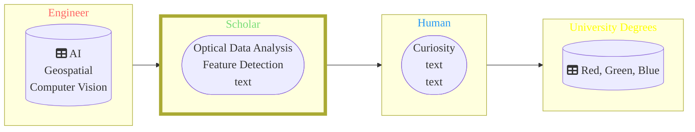

## Hi there 👋 , **I am open for work** 

# 💫 About Me:
I am a Computer vision and geospatial Engineer with a focus on Structure-from-Motion, 3D reconstruction, AI and optical sensor data from Camera, UAV or Satellite. I have several years of experience as project member, Teaching Assistant (TA) and mentor.     Overall Goal: The development of an algorithm based on a repeatable workflow/ pipeline to solve a problem.    **I am open for work** 

## 🌐 Socials:
   

# 💻 Tech Stack:
                                 

