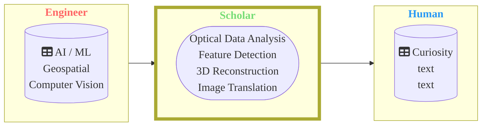
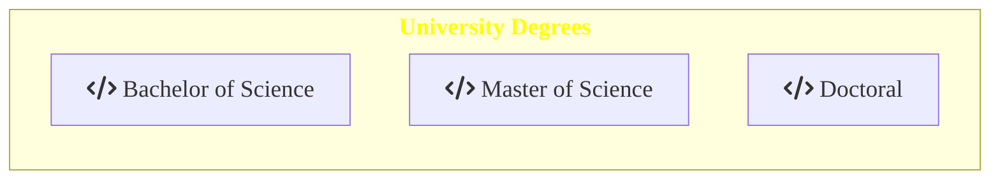

## Hi there &nbsp;👋 &nbsp;, &nbsp;&nbsp;&nbsp;&nbsp; I am open for work

# 💫 About Me:
I am a Computer vision and geospatial Engineer with a focus on Structure-from-Motion, 3D reconstruction, AI and optical sensor data from Camera, UAV or Satellite. I have several years of experience as project member, Teaching Assistant (TA) and mentor.     Overall Goal: The development of an algorithm based on a repeatable workflow/ pipeline to solve a problem.    **I am open for work** 

## 🌐 Socials:

  
# 💻 Tech Stack:
                                
 

 
 
 

